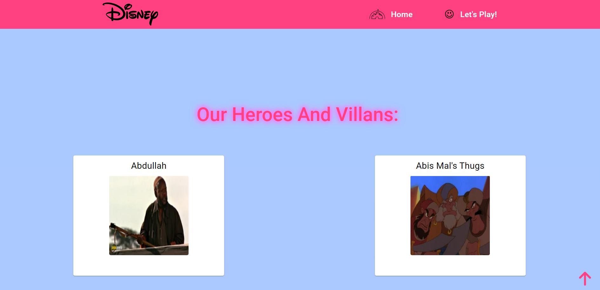

# A DISNEYLAND PROJECT:

## Project Description:
This website is a single-page-app, it has been developed with Angular and its styles with a mix of CSS and Angular Material.
All the data of the website comes from a JSON server and we can perform all the CRUD operations.
We have a list od Disney Characters and we can get to create new ones, delete them, and update them.

## Wireframes:
  

## Setup:
Open the JSON server found in the services folder with comand:

 - *$ json-server --watch data.json --port 8000*

Open the console on the project folder and run the command:

 - *$ ng serve --open*

## Technologies used:
For the layout and styling of the app I have used : 

 - HTML
 - CSS
 - ANGULAR MATERIAL

For the functionalities of the website I have used:

 - Angular

##    Components and Pages structure

 1. Landing: Just a welcome page.
 2. Home: A page where a list of all characters is rendered, if you click on them it will take you to the detail page.
 3. Details Page: A page with more info of each character, it has 2 buttons: go back or edit. Go back will take you to the Landing component, Edit will take you to Edit character component.
 4. Edit-character component: A form where you can update your chosen character info, or delete it.
 5. Play-page component: A form where you can create your own character.
 6. Nav bar: a navbar on top to make it easier to go from Home page component to the Play page component.

## Demo:
Landing:

Home:

Detail character page:

Edit Character Page:

Create new Character Page:

## Task management:
[Click to go to Trello Board](https://trello.com/b/m7CcZ0yR/angular-porject)

## Presentation slides:
[Click to go to Presentation Slides](https://www.canva.com/design/DAFUeWHDXEc/e07b7ixThljf_WEAyZ-33Q/edit?utm_content=DAFUeWHDXEc&utm_campaign=designshare&utm_medium=link2&utm_source=sharebutton)

## Future work:
In the future I would like to implement a new functionality to allow the user to choose his/hers favourite characters and render them in a "Favourite list" as it´s shown in the wireframes.

## Resources:

 1. The Ironhack website.
 2. Stack overflow.
 3. Angular material documentation.
 4. Angular documentation.
 

## Team members:
Creator: Blanca Bigeriego
Collaborators: My teachers: Raymond Maroun and Shaun Reilly.
